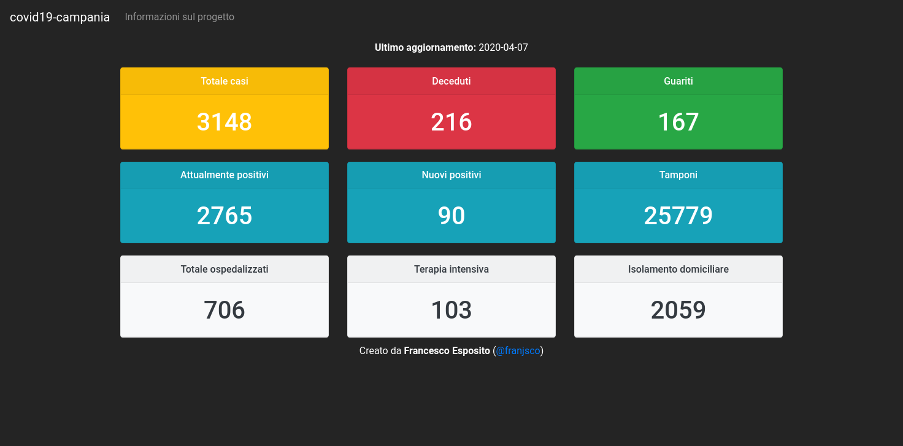

<h1 align="center">Welcome to covid19-campania 🚨</h1>
<p>
  <a href="#" target="_blank">
    
  </a>
  <a href="https://twitter.com/franjsco" target="_blank">
    
  </a>
</p>

> Dashboard emergenza COVID-19 in Campania.

### 🏠 [Dashboard covid19-campania](https://franjsco.github.io/covid19-campania)



> I dati presenti all'interno dashbord sono prelevati dal [repository ufficiale](https://github.com/pcm-dpc/COVID-19) della Protezione Civile. 
## Install

```sh
npm install
```

## Usage
**Development**
```sh
npm run start
```

**Production**
```sh
npm run build
npm install -g serve
serve -s build
```
Other Solutions: [here](https://create-react-app.dev/docs/deployment/)


## Author

👤 **franjsco (Francesco Esposito)**

* Website: https://franjsco.github.io/
* Twitter: [@franjsco](https://twitter.com/franjsco)
* Github: [@franjsco](https://github.com/franjsco)

## Show your support

Give a ⭐️ if this project helped you!

***
_This README was generated with ❤️ by [readme-md-generator](https://github.com/kefranabg/readme-md-generator)_