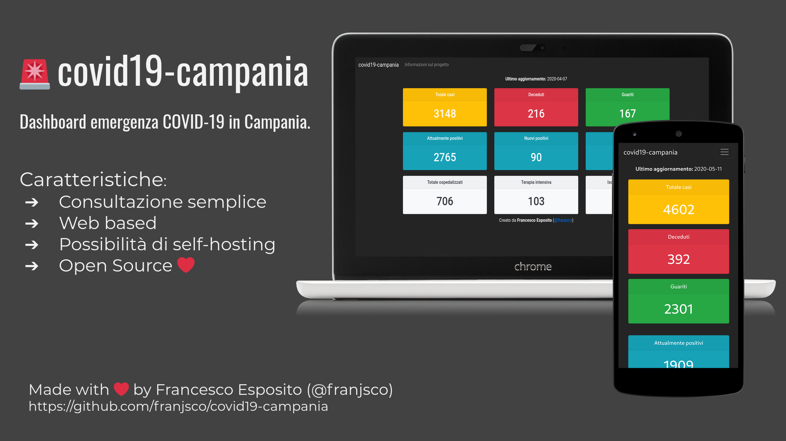

# covid19-campania
Semplice dashboard per la consultazione immediata e semplificata dei dati relativi all'emergenza COVID-19 per la Campania.

La dashboard può essere consultata al seguente indirizzo: 
https://franjsco.github.io/covid19-campania/

## Provenienza dei dati
I dati nella dashbord sono prelevati da un servizio web (REST API) messo a disposizione da OpenPuglia.

Il [servizio web di OpenPuglia](https://github.com/ondata/covid19italia) è agganciato ai dati ufficiali pubblicati sul [repository della Protezione Civile](https://github.com/pcm-dpc/COVID-19) come indicato dal loro repository. 

## License
GPLv3

---
Made with ❤️ by Francesco Esposito ([@franjsco](https://github.com/franjsco))
